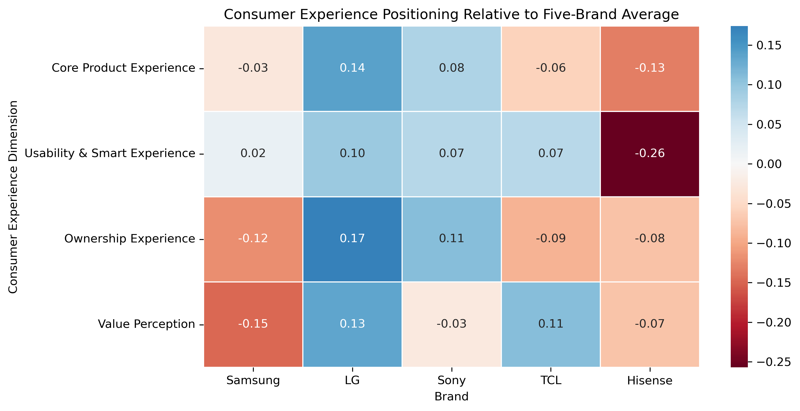
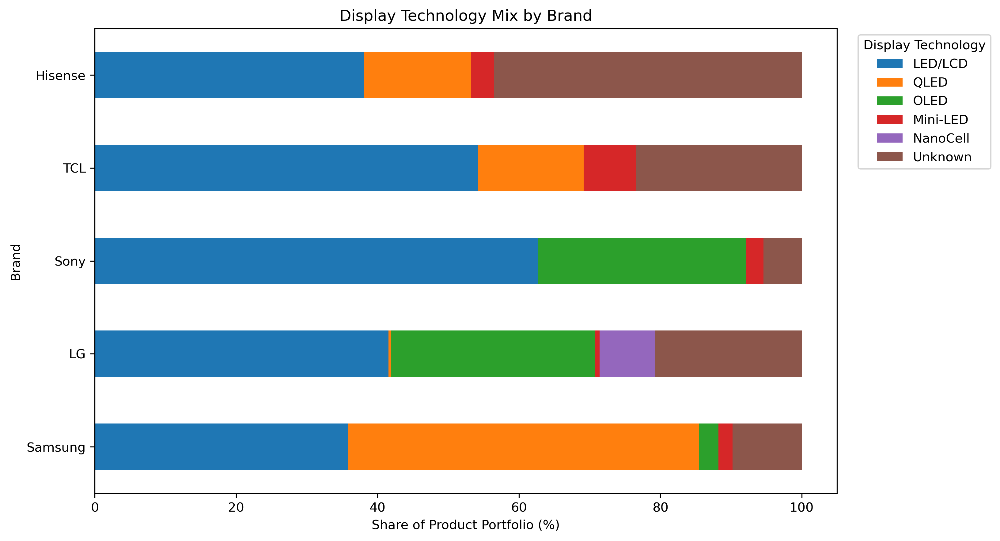
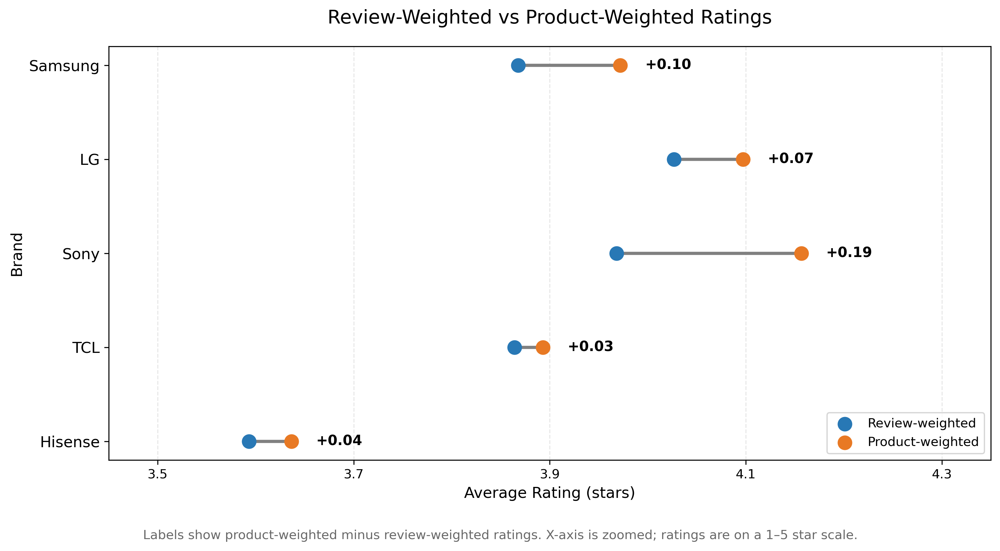

# Smart TV Consumer Intelligence & Competitive Positioning

### Analyzing 111K Amazon consumer reviews and 1,097 Smart TV products

## Project Overview

The Smart TV market is highly competitive, with brands differentiating through
display technology, product features, usability, and the overall ownership
experience. This project analyzes Amazon product metadata and consumer reviews
to examine how these differences are reflected in consumer satisfaction and
brand positioning.

The analysis focuses on five major Smart TV brands — **Samsung, LG, Sony, TCL,
and Hisense** — using a final analytical sample of **1,097 products and 111,191
consumer reviews**.

### Research Question

> **What product attributes are associated with consumer satisfaction in the
> Smart TV market, and how are major brands positioned relative to competitors?**

## Analysis Pipeline

The project follows an end-to-end consumer intelligence workflow:

1. **Data Collection** — Extract Smart TV product metadata and consumer reviews
   from the Amazon Reviews 2023 dataset.
2. **Data Cleaning** — Define the analytical Smart TV sample, clean review text,
   and extract product attributes such as screen size, resolution, and display
   technology.
3. **Exploratory Analysis** — Examine market composition, ratings, review
   concentration, and product-level differences.
4. **Consumer Review Analysis** — Analyze review language to identify consumer
   experience themes and their associations with satisfaction.
5. **Competitive Positioning** — Integrate product portfolio characteristics
   with consumer experience signals to compare the five brands.
   ---

## Dataset

**Source:** Amazon Reviews 2023 — Electronics dataset (McAuley Lab)

The analysis focuses on five Smart TV brands: Samsung, LG, Sony, TCL, and Hisense.

| Dataset stage           | Products | Reviews |
| ----------------------- | -------: | ------: |
| Initial TV dataset      |    3,027 | 218,226 |
| Final analytical sample |    1,097 | 111,191 |

**Analytical period:** 2015–2023.

The final sample was constructed by identifying Smart TV-related terminology in product metadata, extracting model years, restricting the analytical period, and matching reviews to the selected products. Empty review texts and exact duplicate reviews were removed.

Because valid price information was available for only 9.25% of the initial products, price was not used as a primary analytical variable. Instead, consumer perceptions of value were examined through review text.

## Key Findings

### 1. Rating aggregation changes brand comparisons

Review-weighted and product-weighted ratings produce different results because products receive unequal numbers of reviews.

For example, Sony's review-weighted average rating is 3.97 stars, compared with a product-weighted average of 4.16 stars.

This distinction matters when interpreting brand-level satisfaction because a small number of highly reviewed products can disproportionately influence review-weighted results.

### 2. Review volume is concentrated among popular products

TCL's five most-reviewed products account for approximately 67.71% of its reviews.

This concentration suggests that brand-level averages may reflect the experiences associated with a relatively small number of popular products rather than the entire product portfolio equally.

### 3. Product specifications show descriptive associations with ratings

OLED products average approximately 4.29 stars, compared with 3.98 stars for LED/LCD products.

Screen size, resolution, and display technology also show differences across rating groups. However, these patterns are descriptive associations and do not establish that a particular specification causes higher satisfaction.

### 4. Consumer experience extends beyond hardware specifications

Picture Quality is the most frequently mentioned consumer experience aspect, appearing in approximately 40.8% of reviews.

Ease of Use & Setup is positively associated with ratings in the regression analysis, while reviews mentioning Reliability and Customer Support show strong negative associations.

These findings suggest that consumer ratings reflect both the product experience and problems encountered during ownership.

Importantly, an aspect mention indicates that a topic was discussed. It does not directly measure whether the reviewer expressed positive or negative sentiment about that specific aspect.

### 5. Brands exhibit different competitive profiles

The competitive positioning analysis combines product portfolio characteristics with review-based consumer experience measures.

LG shows above-average aspect-associated ratings across several experience dimensions, while Sony also shows positive relative results in multiple areas.

TCL shows relatively positive results in usability and value, while Samsung and Hisense display different patterns across the measured dimensions.

These profiles describe differences within the five-brand analytical sample rather than overall brand quality or current market performance.

---

## Key Visualizations

### Consumer Experience Positioning



*Relative aspect-associated ratings across four consumer experience dimensions, measured against the five-brand average. Positive and negative values represent differences from the sample average, not absolute product-quality scores.*

### Display Technology Mix by Brand



*Distribution of extracted display technology categories across the five brands. Categories are inferred from product metadata and may contain classification errors or unknown values.*

### Review-Weighted vs. Product-Weighted Ratings



*Comparison of two brand-rating aggregation methods, illustrating the influence of unequal review volume across products.*

---

## Methodology

The project uses an end-to-end consumer intelligence workflow.

**Data collection and cleaning:** Amazon product metadata and reviews were processed, filtered to the Smart TV category, and restricted to the analytical period. Product attributes were extracted using rule-based text processing.

**Exploratory analysis:** Brand representation, rating distributions, review concentration, and product specification associations were examined.

**Consumer review analysis:** Keyword-based aspect identification was used to detect mentions of Picture Quality, Sound, Ease of Use & Setup, Smart Features & Apps, Remote, Reliability, Customer Support, and Value.

Aspect mention rates and associated review ratings were calculated. An OLS regression with HC3 robust standard errors was used to examine associations between aspect mentions and overall review ratings.

**Competitive positioning:** Product portfolio composition and consumer experience measures were integrated to construct descriptive brand profiles across Core Product, Usability & Smart, Ownership, and Value dimensions.

---

## Limitations

* **Historical data:** The analysis covers 2015–2023 and should not be interpreted as a description of the current Smart TV market.
* **Selection bias:** Amazon reviewers and the selected products may not represent all Smart TV buyers or products.
* **Review concentration:** Highly reviewed products can disproportionately influence review-weighted results.
* **Keyword-based analysis:** Aspect mentions do not directly measure aspect-specific sentiment. Keyword matching may miss relevant expressions or produce false positives.
* **Product attribute extraction:** Specifications inferred from product titles and metadata may contain errors or missing values.
* **Observational analysis:** Reported relationships are associations, not causal effects.
* **Price limitations:** Incomplete price information prevents a comprehensive price-based competitive analysis.

---

## Repository Structure

```text
smart-tv-consumer-intelligence/
├── data/
│   └── README.md
├── notebooks/
│   ├── 01_data_collection.ipynb
│   ├── 02_data_cleaning.ipynb
│   ├── 03_exploratory_analysis.ipynb
│   ├── 04_consumer_review_analysis.ipynb
│   └── 05_competitive_positioning.ipynb
├── outputs/
│   ├── figures/
│   └── tables/
├── .gitignore
├── README.md
└── requirements.txt
```

The Parquet datasets are excluded from GitHub because of their size. The notebooks document the data preparation and analysis workflow.

## How to Run

Run the notebooks from the `notebooks/` directory because the relative data and output paths are defined from that working directory.

1. Clone this repository and install the dependencies listed in `requirements.txt`.
2. Obtain the Amazon Reviews 2023 Electronics dataset and run `01_data_collection.ipynb` to generate the raw product and review Parquet files.
3. Run `02_data_cleaning.ipynb` to construct the final analytical sample.
4. Run `03_exploratory_analysis.ipynb`, followed by `04_consumer_review_analysis.ipynb` and `05_competitive_positioning.ipynb`.

The original large-scale data collection was performed in Google Colab. Subsequent cleaning and analysis were conducted locally in VS Code.

The data collection notebook has not been fully re-executed in the final local environment. Reproducing the project from scratch requires downloading and processing the original dataset.

---

## Tools and Libraries

Python, pandas, NumPy, Matplotlib, Seaborn, scikit-learn, statsmodels, Hugging Face Datasets, Jupyter Notebook, and Google Colab.
